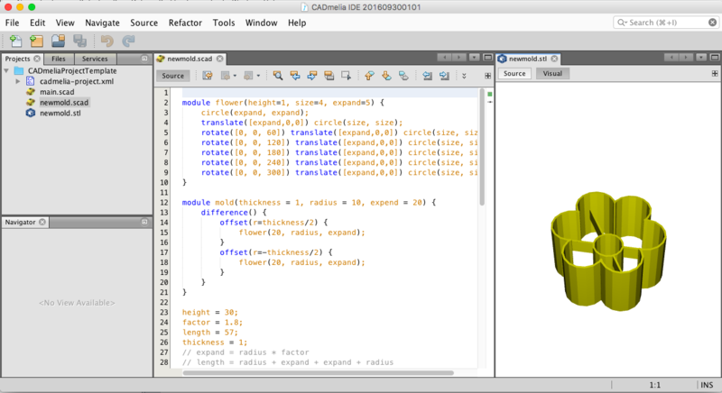
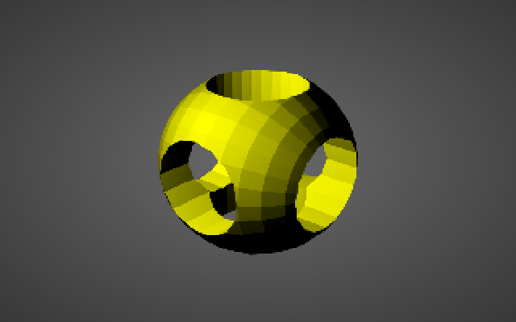
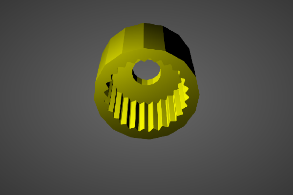

# CADmelia

CADmelia is an open-source CAD tool for creating 3D CAD models. It focus on the CAD aspects of
3D modelling, and the goal is to help creating 3D printed objects (CAM : Computer Aided Manufacturing)



Like OpenSCAD it is not an interactive modeller. Instead it is something like a 3D-compiler that
reads in a script file that describes the object and renders the 3D model from this script file.
This gives you (the designer) full control over the modelling process and enables you to easily change
any step in the modelling process or make designs that are defined by configurable parameters.

Two modelling techniques are provided :

- Constructive Solid Geometry (CSG)
- Extrusion of 2D shapes

The model can be exported in STL format.





CADmelia uses the modeling language defined by OpenSCAD (see [The_OpenSCAD_Language]
(https://en.wikibooks.org/wiki/OpenSCAD_User_Manual/The_OpenSCAD_Language)).


It is free software, licensed under EUPL, and available for Windows and MacOSX (not tested under Linux
but should work as it is based on Java).

# Download

Download Windows 64-bits and MacOSX version from the [release page](https://github.com/naramski/cadmelia/releases).

# How to Build

## Requirements

The build requires Gradle and Java => 1.8.

The project requires uses two dependecies that are not (yet) published on a Maven
repository.

In order to build the project, make sure that:

- Your local Maven repository contains version 0.2-SNAPSHOT of
[FXyz](https://github.com/naramski/FXyz)

## Command Line

Deploying fxyz

    git clone https://github.com/naramski/FXyz
    git checkout develop
    gradle publishToMavenLocal

The project is managed with [Gradle](http://www.gradle.org/).

    gradle assemble

The cadmelia-ide is built with Netbeans 8.2

# License

This software are all the components are licensed under the EUPL license.

```
/*
 * Copyright 2017 David Naramski.
 *
 * Licensed under the EUPL, Version 1.1 or - as soon they will be approved by the
 * European Commission - subsequent versions of the EUPL (the "Licence");
 * You may not use this file except in compliance with the License.
 * You may obtain a copy of the License at:
 *
 *      http://joinup.ec.europa.eu/software/page/eupl/licence-eupl
 *
 * Unless required by applicable law or agreed to in writing, software
 * distributed under the License is distributed on an "AS IS" basis,
 * WITHOUT WARRANTIES OR CONDITIONS OF ANY KIND, either express or implied.
 * See the License for the specific language governing permissions and
 * limitations under the License.
 */
```

